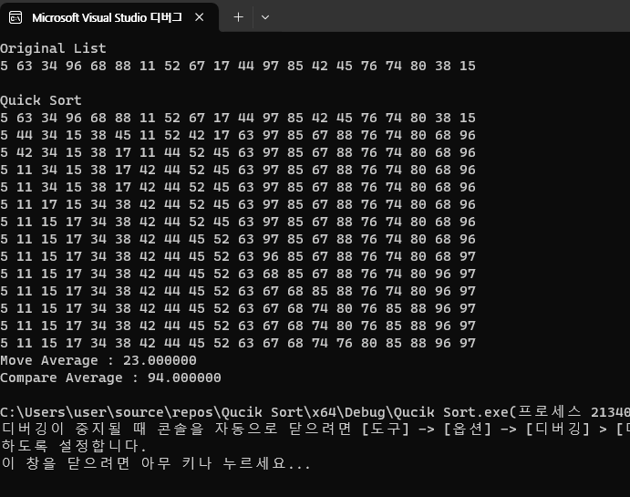

selection sort / 이동 : 19 / 비교 : 190 
insertion sort / 이동 : 119 / 비교 : 119 
bubble sort / 이동 : 79 / 비교 : 190 
shell sort / 이동 : 60 / 비교 : 35 
merge sort / 이동 : 130 / 비교 : 74 
quick sort / 이동 : 23 / 비교 : 94 
 
선택 정렬의 경우 이동 횟수는 적지만 비교 횟수가 큼으로 다소 시간이 오래걸리는 방법이고, 삽입 정렬의 경우에는 비교와 이동을 동시에 하기 때문에 이동과 비교 횟수가 모두 높아서 적합한 정렬로 보기에는 힘들거 같다.
버블 정렬의 경우 삽입 정렬보다는 이동 횟수가 적지만 여전히 높은 이동과 비교 횟수를 가지고 있다, 쉘 정렬의 경우에는 비교 횟수가 적지만 이동 횟수가 많다는 점이 조금 시간을 차지하는데 문제가 될 거이라는 생각이 든다.
합병 정렬의 경우에는 계속해서 두 부분으로 나누어서 비교한 후 합친다는 것을 통해 시간을 줄이는 것에서는 의미가 있지만 이동과 비교 횟수가 조금 높다고 생각이 된다. 그에 비해 퀵 정렬을 사용해서 정렬을 할 경우엔 비교
횟수를 조금 적게 가져가면서도 적은 이동 횟수를 챙길 수 있다는 점을 보아 데이터를 정렬할 때에는 퀵 정렬을 사용하는 것이 가장 효율적일 것이라는 생각이 든다.

# Qucik Sort

